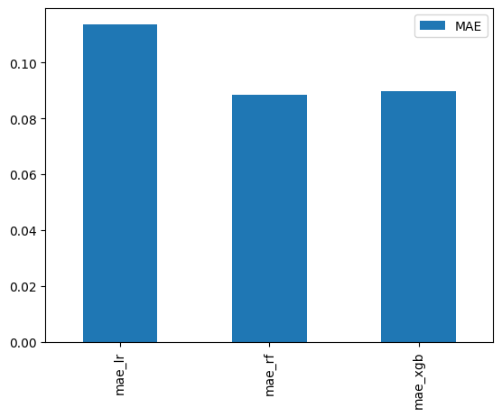

# Apartment Prices in Poland

Apartment prices in Poland have been rising steadily, making it difficult for many people to decide where and what kind of apartment they can afford. This project aims to provide a simple tool that predicts apartment prices based on location and key property parameters. By selecting a city and specifying apartment details, users can receive an estimated price per square meter, helping them explore affordability and make informed decisions about potential purchases. Additionally, the application allows users to evaluate whether their current property has increased in value, giving them insights into market trends and potential resale opportunities.

The data was sourced from: https://www.kaggle.com/datasets/krzysztofjamroz/apartment-prices-in-poland

### Objective
* Develop a predictive model that estimates apartment prices based on location and apartment features.
* Provide an easy-to-use interface for users to input key details.
* Help users determine where they may want to move or what type of apartment fits their budget.

### Conclusions

The most important factors influencing apartment prices are city and build year. Newer apartments tend to have significantly higher prices compared to older buildings. Additionally, for apartments with the same characteristics, prices in large cities like Warszawa or Kraków can be twice as high as in smaller cities such as Szczecin or Radom. This highlights the strong impact of urban demand and property age on real estate values.

## Table of Contents

1. [Project Architecture](#project-architecture)
2. [File Descriptions](#file-descriptions)
3. [Executive Summary](#executive-summary)


## Project Architecture

```bash
├── config
├── data
│   ├── processed
│   └── raw
├── docs
├── models
├── notebooks
│   ├── all_cities
│   └── krakow
├── tests
│   └── test_data
```

## File Descriptions
<details>
[config](config): folder containing configuration files
* [bins.json](config/bins.json): bins used for splitting data in 'distance' columns. File is used for feature engineering new data from user.

[data](data): folder containing all data files 
* [processed](data/processed): datasets that undergone preliminary cleansing, transformations and other preparatory steps
  * [processed_data_all.csv](data/processed/processed_data_all.csv): processed data for all cities from original dataset
  * [processed_data_Krakow.csv](data/processed/processed_data_Krakow.csv): data filtered by city of Krakow and processed
* [raw](data/raw): original datasets
  * [apartments_pl_2024_06.csv](data/raw/apartments_pl_2024_06.csv): original dataset with apartment prices from June 2024
 
[images](images): folder containing images for documentation 
* [model_comparison.png](images/model_comparison.png): png file with bar chart comparing MAE for 3 different models

[models](models): folder containing trained algorithms
* [encoders.pkl](models/encoders.pkl): trained OneHotEncoder for all categorical columns
* [xgboost_all_cities.pkl](models/xgboost_all_cities.pkl): XGBoost model trained on data for all cities
* [xgboost_krakow.pkl](models/xgboost_krakow.pkl): XGBoost model trained on data for city of Krakow

[notebooks](notebooks): folder containing notebooks with all project steps
* [all_cities](notebooks/all_cities): notebooks for processing dataset with all cities included
  * [create_model_for_all_cities.ipynb](notebooks/all_cities/create_model_for_all_cities.ipynb): notebook with use of pre-defined functions for data preparation and model training for dataset with all cities included
  * [data_preparation_functions.py](notebooks/all_cities/data_preparation_functions.py): functions for feature selection and engineering
  * [prediction_app.ipynb](notebooks/all_cities/prediction_app.ipynb): notebook with the application that makes a prediction based on user's input
* [krakow](notebooks/krakow): notebooks for processing dataset filtered by city of Krakow
  * [1_data_and_feature_preparation.ipynb](notebooks/krakow/1_data_and_feature_preparation.ipynb): notebook with data exploration and preparation based on dataset filtered by city of Krakow
  * [2_model_training_and_evaluation.ipynb](notebooks/krakow/2_model_training_and_evaluation.ipynb): notebook with steps for training and selecting the best model

[tests](tests): folder containing test cases and test data
* [test_data](tests/test_data): cvs files containing sample data for testing
  * [sample.csv](test_data/tests/sample.csv): csv file containing raw sample data
  * [sample_processed.csv](test_data/tests/sample_processed.csv): csv file containing processed sample data with no missing values
* [test_data_preparation_functions.py](tests/test_data_preparation_functions.py): file containing unit tests for [data_preparation_functions.py](notebooks/all_cities/data_preparation_functions.py)
</details>

## Executive Summary

### Data Collection
<details>
The dataset consists of apartment listings across Poland from June 2024, including features such as:
location, build year, building type, condition, floor details, proximity to Points of Interest (POIs) and city centre, additional features like parking space or balcony etc. 
The data was sourced from https://www.kaggle.com/datasets/krzysztofjamroz/apartment-prices-in-poland and contained missing values and outliers that required preprocessing.

The original dataset consists of following columns:
* *city* - the name of the city where the property is located
* *type* - type of the building
* *squareMeters* - the size of the apartment in square meters
* *rooms* - number of rooms in the apartment
* *floor / floorCount* - the floor where the apartment is located and the total number of floors in the building
* *buildYear* - the year when the building was built
* *latitude, longitude* - geo coordinate of the property
* *centreDistance* - distance from the city centre in km
* *poiCount* - number of points of interest in 500m range from the apartment (schools, clinics, post offices, kindergartens, restaurants, colleges, pharmacies)
* *[poiName]Distance* - distance to the nearest point of interest (schools, clinics, post offices, kindergartens, restaurants, colleges, pharmacies)
* *ownership* - the type of property ownership
* *condition* - the condition of the apartment
* *has[features]* - whether the property has key features such as assigned parking space, balcony, elevator, security, storage room
* *price* - offer price in Polish Zloty
</details>

### Data Cleaning and Preprocessing
<details>


To simplify preprocessing and model development, I focused on one city (Kraków) instead of the entire dataset. This reduced computational complexity and allowed for a more detailed analysis of local patterns before scaling the model.  

**The data cleaning process included:**  
* **Feature Engineering** – Created new columns, including `locationCategory` (based on latitude and longitude) and `price_per_m2`. Split distance columns into bins.  
* **Handling Missing Values** – Imputed missing values using statistical measures (mean, mode, median).  
* **Outlier Detection & Removal** – Winsorized extreme values in `price_per_m2`, `buildYear`, `squareMeters`, and `poiCount`. Applied log transformation to `price_per_m2` for normalization.  
* **Feature Selection** – Removed columns that could lead to data leakage, were highly correlated with other features, or were quasi-constant. Verified important features using **Random Forest Feature Importances**, **Recursive Feature Elimination (RFE)**, and **Forward Feature Selection**.  
* **Encoding** – Used **OneHotEncoder** to convert categorical variables into numerical formats.  

</details>

### Model Selection  
<details>
To determine the most suitable model for predicting apartment prices per square meter, I trained and evaluated three different algorithms: **Linear Regression (LR), Random Forest (RF), and XGBoost (XGB)**. The models were assessed based on **prediction time, Mean Absolute Error (MAE), and R² score** on the test set.  

| Model              | Prediction Time (s) | Test MAE  | R² Score  |
|--------------------|--------------------|----------|----------|
| **Linear Regression** | 0.0148             | 0.1138  | 0.4790   |
| **Random Forest**   | 0.0766             | 0.0886  | 0.6314   |
| **XGBoost**        | 0.0104             | 0.0898  | 0.6259   |

#### Key Observations:
* **Linear Regression** had the weakest predictive performance, with the highest MAE and lowest R² score.  
* **Random Forest** had the best R² and lowest MAE, but it also had the longest prediction time.  
* **XGBoost** performed comparably to Random Forest, with a slightly higher MAE and slightly lower R², but had the fastest prediction time among the tree-based models.

The chart below compares the Mean Absolute Error (MAE) for each model, highlighting their predictive performance.


#### Model Choice:
Given the balance between accuracy and efficiency, **XGBoost was selected as the final model**. While its R² was slightly lower than Random Forest, it provided similar predictive performance with a **notably faster prediction time**, making it a more scalable choice for future expansion.  

**Current Scope:** All evaluations and model training were conducted on **data from a single city (Kraków)**. 
</details>

### Scaling Model to the Full Dataset  
<details>
After selecting **XGBoost** as the best model based on one city's data, I scaled the data preparation and model creation for the entire dataset. To ensure consistency and efficiency, I developed **data preparation functions** that automated key preprocessing steps, including data cleaning, feature selection, and feature engineering.  

I then trained an **XGBoost model** on the full dataset, achieving the following results:  

* **Prediction Time:** 0.0401s  
* **R² Score:** 0.8692  
* **Mean Absolute Error (MAE):** 0.1017

To validate the model and prevent **data leakage**, I analyzed **Feature Importances** using a chart. This helped ensure that no single feature dominated the predictions and allowed me to identify the most influential factors in apartment price estimation.  

To enable future predictions with the same preprocessing logic, I saved the bins used for splitting numerical features and stored the OneHotEncoders for categorical variables. This ensures that the model can handle new data in a consistent manner.
</details>

